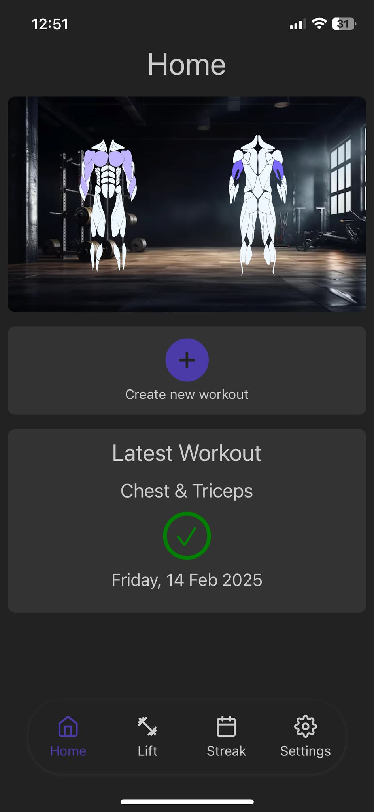
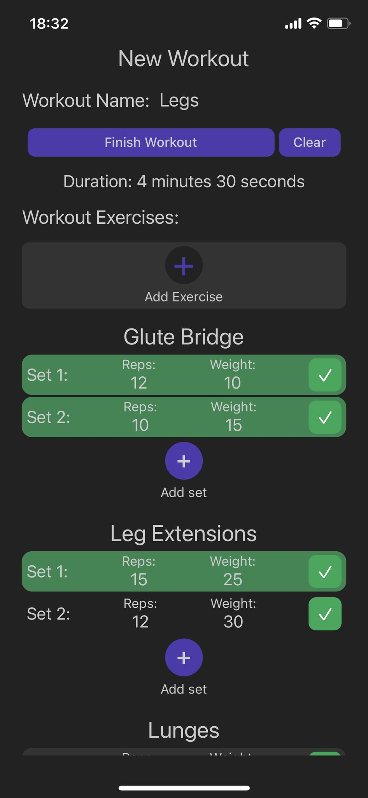
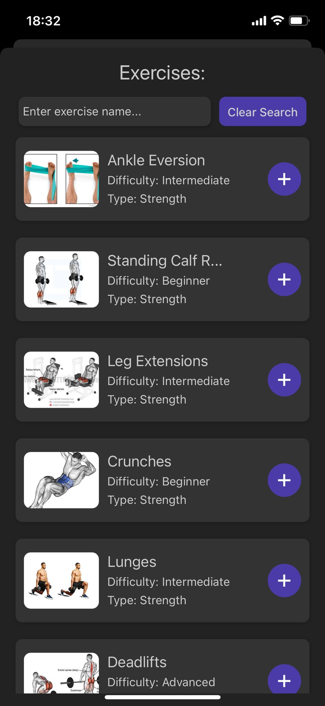

# LIFT / Gym Tracker
LIFT makes it easy to track your gym workouts. You can create new workouts, look back at your workout history, and check your most recent session. There’s also a heatmap showing which muscles you’ve worked this week, along with stats on how often you’ve exercised and how close you are to reaching your goals.

# User Interface
| HomeScreen                               | New workout                                       | Exercises                                        |
|------------------------------------------|---------------------------------------------------|--------------------------------------------------|
|  |  |  |

# User Flows
| Adding exercises                                                                        | Statistics                                                                           | Workout                                                                           |
|-----------------------------------------------------------------------------------------|----------------------------------------------------------------------------------------|-----------------------------------------------------------------------------------|
|  |  |  |

# Used Technologies
- **Frontend**: React Native
- **Backend**: NestJS
- **Database**: SQLite

