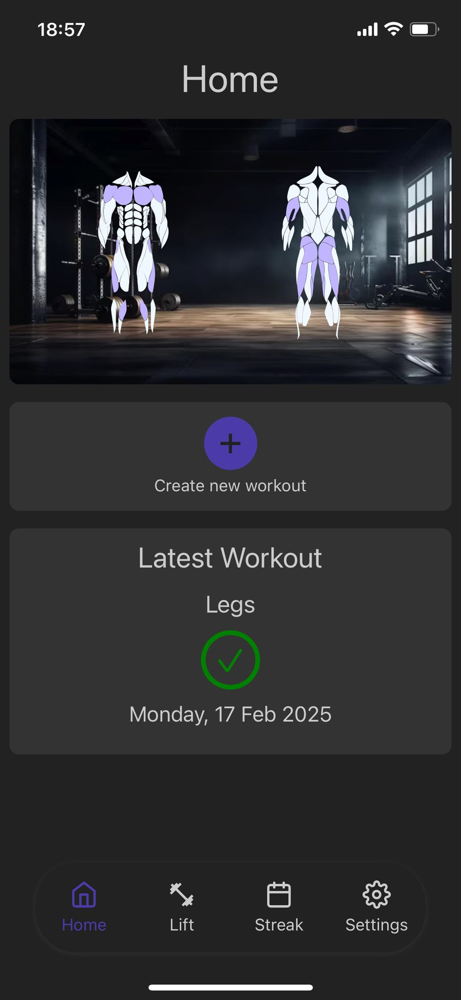
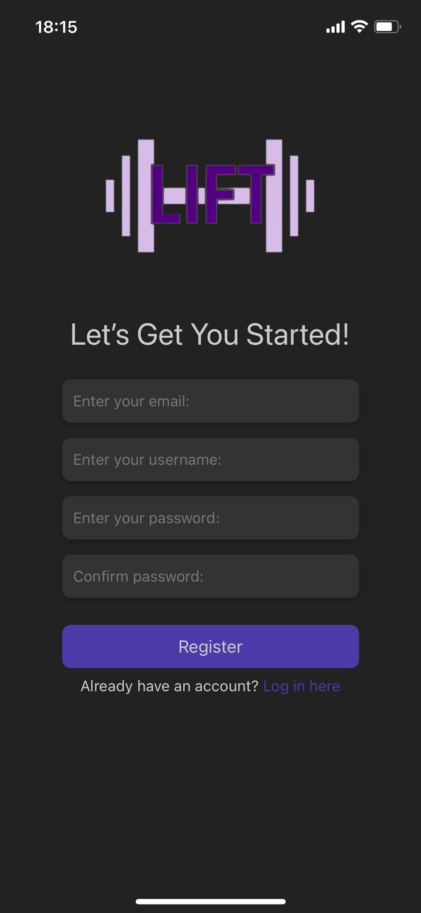

# LIFT - Your Gym Companion
> A new way to enjoy working out

### LIFT is a mobile application developed using React Native and NestJS, designed to help people stay healthy and motivated at the gym. Whether you're a beginner or an experienced lifter, LIFT provides the tools and motivation you need to reach your fitness goals.
#### On the HomeScreen you can see a Heatmap of all the muscles you worked this week, helping you keep track of your weekly progress. There is also a button that lets you create a new workout, and a information card with the latest completed workout.

#### When creating a new workout you will be prompted with a screen where you can input the name of the workout and select exercises, sets, reps and weight.

  
  

#### On the LiftScreen you can see all of your past workouts and read information about each of them. Also, if you select one of them you can get a more in depth look into your workouts and exercises.

https://github.com/user-attachments/assets/2c576624-1fc9-411c-9168-6b69e2b65aa9

#### On the StreakScreen, you can view all the days you've worked out, along with your progress toward achieving your fitness goals. Below this, you'll find a helpful tool designed to assist you in reaching those goals by calculating and providing your recommended daily calorie and macronutrient intake.

https://github.com/user-attachments/assets/cf9e809a-00f0-4878-8554-77654e9d03e6

#### On the SettingsScreen, you can upload your profile picture, switch between light and dark mode, set your current and goal data to help you reach your goals, and log out using the log out button.

#### Using the LogIn and Register screen you can create an account or just log in into an existing one with ease.

  
  

#### If the dark theme is not your cup of tea, you can always just switch to light theme.

  
  
  
  
  
  

## Tech Stack

- **Frontend**: React Native
- **Backend**: NestJS
- **Database**: SQLite
- **Authentication**: JWT

